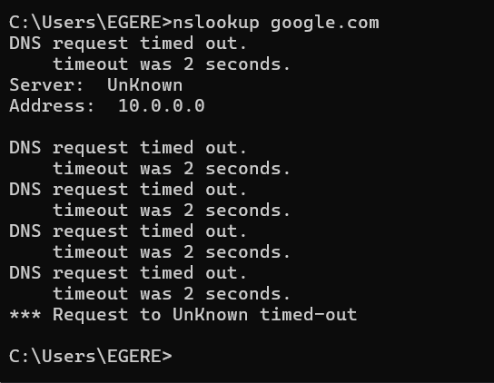

# DNS CONNECTIVITY RESOLUTION

**Role:** IT Support Specialist
**Tools:** Command Prompt (ping, nslookup, ipconfig), Windows Network Adapter Settings (IPv4)

---

##  PROJECT DESCRIPTION
A client reported internet failure on a home workstation shortly after family use. My job was to diagnose the "Connected but no Internet" error, identify unauthorized configuration changes, and restore service. The following steps demonstrate how I resolved a DNS misconfiguration caused by user error.

---

## 1. DIAGNOSE CONNECTIVITY LAYERS
The client received an `ERR_NAME_NOT_RESOLVED` error. I needed to distinguish between a physical network outage and a software configuration issue.

The following screenshot demonstrates how I used `ping` to verify physical connectivity.

**ANALYSIS:**
The screenshot confirms active hardware connectivity. I ran `ping 8.8.8.8` to test the connection to an external IP. The successful replies proved the network card and router were functional, allowing me to rule out ISP outages and focus on the workstation's software settings.

---

## 2. IDENTIFY CONFIGURATION ERROR
Suspecting a manual setting change, I inspected the Network Adapter properties to determine how the machine was resolving web addresses. The following screenshot reveals the incorrect DNS entry.

**Root Cause:**
The screenshot exposes the root cause. The "Obtain DNS automatically" setting was disabled, and had been manually configured to a static DNS address of `10.0.0.0`. Since this is an invalid private address for public resolution, the computer was sending requests to a non-existent server.

---

## 3. IMPLEMENT AND VERIFY RESOLUTION
To restore access, I needed to correct the invalid entry and clear the system's error history. The following demonstrates how I configured reliable DNS servers and flushed the cache.

**Outcome:**
The screenshots show the resolved configuration:
I replaced the invalid `10.0.0.0` entry with reliable public DNS servers: `1.1.1.3` (Cloudflare) and `1.0.0.3`. I then ran `ipconfig /flushdns` in Command Prompt to clear the failed cache. This immediately restored full internet browsing for the client.

---

##  SUMMARY
I diagnosed a connectivity loss caused by accidental user error. I used `ping` to confirm active internet, identified an invalid manual DNS entry (`10.0.0.0`), and restored service by configuring valid public DNS servers and flushing the cache.
